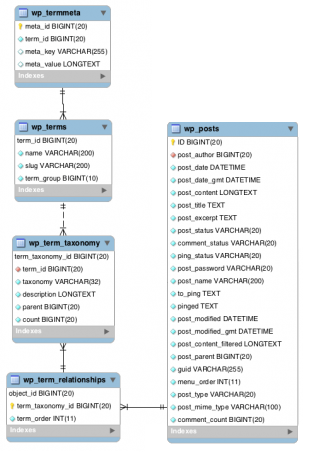

#### Categories, Tags, & Custom Taxonomies
Categories, tags和taxonomies相互之间有关联的并且很容易混淆。

我们将通过使用针对美食站点而构建的主题的例子来帮助我们克服关于categories, tags, 和 taxonomies的知识。

在我们的美食站点中，categories(分类目录)就是早餐，午餐，晚餐，小菜，汤，色拉，甜品。所有菜单将会用这种分类来集中管理。但是用户也许会想搜索一些特别的比如像巧克力甜品或者老姜鸡。

巧克力，姜，和鸡就相当于tags。他们从另一个层面给用户提供了途径来找到菜品。

最后，就是taxonomies(分类方法)。实际上，分类目录和标签是一种简单的taxonomies组织内容的实例。在wordpress中，taxonomies是一种将内容和数据分类的方法(它不具体指哪一个知识点，它只是一种思想，主观将数据按某种属性来分类)。当你使用taxonomy在你将一些类似的内容分类起来的时候。taxonomy指的是这些分类的总和。就像[Post Types](https://developer.wordpress.org/themes/functionality/pages-posts-custom-post-types/),这就是默认的一些taxonomy，你也可以创建你自己的。

正常情况下，食谱按照分类目录和标签来进行组织，除了一些其他有用的方式来拆分食谱来使得用户体验更好。比如，美食站点也许想通过一个简单的方式来展现食谱，像烹饪时间。一个自定义taxonomy的烹饪时间分为0-30分钟，30-60分钟，1-2小时，2+小时，这就是一个很实用的拆分。除此之外，按烹饪方法来分类，烤，蒸，煎，炸等等，这也会是与网站性质相关的taxonomy实例。我们还可以按辣度来给菜品做一个taxonomy，我们将每道菜按辣度分为5个等级。这也是算是一个自定义的taxonomy。

默认的taxonomies

在wordpress中，默认的taxonomies有:
- 分类目录:在文章发布类型中，按一个有层级的分类方式来组织内容。
- 标签:在文章发布类型中，按没有层级的分类方式来组织内容。
- 文章形式:一种在创建文章时为文章添加形式的的方法，你可以在这个[Post Formats](https://developer.wordpress.org/themes/functionality/post-formats/)页面学习更多关于它的信息。

#### Terms(子项目)
Terms就是你分类方法下具体的项目。举例，如果作了一个动物分类，你就会分这些子项目，狗，毛，羊等。子项目可以通过wordpress后台管理来创建，或者使用[wp_insert_term()](https://developer.wordpress.org/reference/functions/wp_insert_term/)函数。

#### 数据库图解
taxonomy和Terms全部存储在下面的数据表中:
- wp_terms -存储了所有的terms。
- wp_terms-taxonomy -在一个分类方法内放置的term
- wp_term_relationships -将taxonomy关联到一个object(比如，文章中的分类目录)

#### 模板
wordpress提供了一系列不同的关于分类目录，标签，自定义分类的模板层级。更多关于他们结构的细节和用法也许可以在[Taxonomy Templates](https://developer.wordpress.org/themes/template-files-section/taxonomy-templates/)中找到。

#### 自定义分类
在wordpress中可能会创建新的分类，比如，在一个图书类型的站点中创建一个作者分类或者在一个电影类型站点创建一个导演分类。跟自定义发布类型一样推荐你将这功能放在一个插件中。这样会确保当用户改变网站的设计的时候，他们的内容会在插件中被保存下来。

你可以在[Plugin Developer Handbook](https://developer.wordpress.org/plugins/taxonomies/working-with-custom-taxonomies/)(插件开发者手册)中阅读更多关于创建自定义分类.
