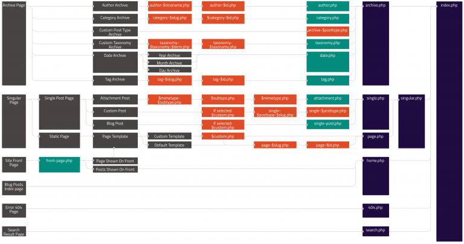

#### 模板层级
如先前讨论的，[template files](https://developer.wordpress.org/themes/basics/template-files/)(模板文件)是模块化，可复用的文件。在wordpress中用来生成页面的。某些模板文件(如header和footer模板)被用于你站点里所有的页面，还有一些其他的仅在一些特定条件下使用。

这个文章诠释了wordpress是怎样来决定什么样的页面使用哪个模板文件。如果你想自定义一个已经存在的wordpress主题，它将会帮助你来决定哪些模板文件需要被编辑出来。

>你还可以使用[Conditional Tags](https://developer.wordpress.org/themes/basics/conditional-tags/)来控制那些被加载在指定页面中对应的模板。

#### 模板文件层级
###### 综述
wordpress使用[query string](https://codex.wordpress.org/Glossary#Query_String)来决定哪个模板或者哪组模板被用于显示页面。这个querystring包含了链接到你网站每个部分的
信息。它是在最初的问号之后出现的，并且可能包含了多个由&符号组成的参数。

简单来说，wordpress会通过模板层级往下搜索，直到找到一个匹配的模板文件。为了决定使用哪个模板文件。wordpres:

- 1.将每个querystring与query类型进行匹配，以此来决定请求哪个页面(例如，一个search page(搜索页面)，一个category page(分类页面)，等等);
- 2.按照模板层级来决定选择模板的顺序;
- 3.在当前主题的文件目录下通过指定名称来寻找模板文件，并且按层级来使用第一个匹配的模板文件作为指定文件。

除了index.php这个基础模板文件之外，你可以选择是否想执行一个指定的模板文件。

如果wordpress通过匹配名找不到模板文件，就会在层级中跳到下一级文件。如果最终找不到任何匹配的模板文件，就会使用主题的index.php来显示。

#### 例子

如果你的博客像[http://example.com/blog/](http://example.com/blog/)这样，并且当一个访问者点击链接到一个像[http://example.com/blog/category/your-cat/](http://example.com/blog/category/your-cat/)这样的分类目录页面，wordpress会在当前主题文件目录找一个模板文件，然后在使用分类id的内容放到这个模板文件中，生成一个正确的页面
> 为了更好了让大家理解上面的过程，举个个人总结例子，模板文件相当于一件衣服，具体某一个ID的内容就相当于一个人。而具体某一个ID的内容是我们通过后台添加的进去的，为了区分不同的内容我们加入了categoryID（分类ID）这个概念。此时此刻这个人将会穿上这件衣服，整体显示人的样貌和衣服的外观。下次可能根据不同的分类ID又换了一个人来穿这件衣服。当然，衣服也是可以换的。

更具体点讲，wordpress会遵循下面这个步骤:
- 1.在当前主题的目录下按照category's slug(分类别名)来找到一个模板文件，如果category(分类目录)的别名是unicorns，wordpress就会找名为category-unicorns.php这个模板文件。
- 2.如果这个别名为unicorns的分类目录的ID为4，并且没有建立category-unicorns.php这个模板文件。那么wordpress会找category-4.php这个模板文件。
- 3.如果找不到category-4.php,wordpress就会找到通用模板文件category.php.
- 4.如果找不到category.php，wordpress就会找到archive.php。
- 5.如果找不到archive.php,wordpress就会返回到主要主题模板文件,index.php。

#### 图文综述
以下图解显示了基于wordpress模板层级生成wordppress页面的对应模板文件。

你也可以通过[interact with this diagram](https://wphierarchy.com/)自己来编辑这个图解。

#### 模板层级的细节
当用图解就会让我们更容易理解模板层级，下面的部分描述了wordpress针对query types(查询类型)使用的模板文件的顺序。

#### 主页显示
默认情况下，wordpress设置你的站点主页来显示你最新的博客文章。这个页面成为博客文章索引页面，你也可以设置你的博客文章在一个独立的静态页面中显示，home.php模板文件被用作博客文章索引页，不管它是用作首页还是单独的静态页面。如果home.php不存在，wordpress会使用index.php。
  1.home.php
  2.index.php
>如果front-page.php存在，就会覆盖home.php模板

#### 首页显示
front-page.php模板文件被用来设置你站点的首页，不管首页是以博客索引页还是一个静态页面来显示。首页模板都会重新覆盖博客索引页(home.php)模板。如果front-page.php文件不存在，wordpress会根据后台中的设置-阅读来决定使用home.php或者page.php。如果它们两个都不存在，将会使用index.php.

- 1.front-page.php-用于后台设置-阅读中的首页显示选项中的-‘你的最新文章’或者一个‘静态页面’。

- 2.home.php-如果wordpress找不到front-page.php并且在首页显示选项中设置了‘你的最新文章’，它就会找home.php。除此之外，在当首页显示选项中设置了文章页，wordpress也会找到这个文件。

- 3.page.php-当首页显示选项中设置了主页。
- 4.index.php-找到index.php当首页显示选项中设置的是‘你的最新文章’，但是home.php不存在又或者是设置的是'主页'但是page.php不存在的时候。

如你所见，wordpress选择路径的优先级有很多规则，使用上面的方法来决定wordpress的显示什么是最好的方式。

#### 文章详情页
文章详情页模板文件被用于显示一个文章详情，wordpress会遵循下面这些路径:
- 1.single-{post-type}-{slug}.php-从4.4版本开始，wordpress会为了显示指定文章，找到类似这样的模板文件single-{post-type}-{slug}.php 。例如，如果发布类型为product，并且文章文件名别名(slug)是dmc-12,wordpress将会找single-product-dmc-12.php.
- 2.single-{post-type}.php-如果只有发布类型为product，那么wordpress就会找single-product.php。
- 3.single.php-如果不存在以上的文件，wordpress会找到single.php。
- 4.singular.php-然后会找到singular.php。
- 5.index-php-最终，经历上面的过程后，wordpress最后回到以Index.php来显示。

#### 页面
这个单页面模板文件被用于显示一个静态页面(页面page发布类型posttype)。需要注意的是不像其他发布类型，page对于wordpress来说是特别的。它遵循以下的路径:
- 1.自定义模板文件-[page template](https://developer.wordpress.org/themes/basics/page-templates/)(页面模板)分配给页面，看看这个[get_page_templates()](https://developer.wordpress.org/reference/functions/get_page_templates/)。
- 2.page-{slug}.php-如果页面别名是recent-news，wordpress会找到并使用page-recent-news.php。
- 3.page-{id}.php-如果页面的ID是6，wordpress会找到并使用page-6.php。
- 4.page.php
- 5.singular.php
- 6.index.php

#### 分类目录
在wordpress中使用分类归档索引页的时候会遵循以下路径规则:
- 1.category-{slug}.php-如果你的分类目录的别名为news，wordpress会找到category-news.php。
- 2.category-{id}.php-如果你的分类目录的ID是6，wordpress会找到
category-6.php。
- 3.category.php
- 4.archive.php
- 5.index.php

#### 标签
在wordpress中使用标签归档索引页的时候会遵循以下路径规则:
- 1.tag-{slug}.php-如果标签的别名是sometag，wordpress会找到tag-sometag.php。
- 2.tag-{id}.php-如果标签的ID是6，wordpress会找到tag-6.php。
- 3.tag.php
- 4.archive.php
- 5.index.php

#### 自定义分类
自定义分类使用了一个稍微不一样的模板文件路径:
1.taxonomy-{taxonomy}-{term}.php-如果{taxonomy}为sometax，{term}为someterm。Wordpress会寻找 taxonomy-sometax-someterm.php。在这个例子中[post formats](https://developer.wordpress.org/themes/functionality/post-formats/),
